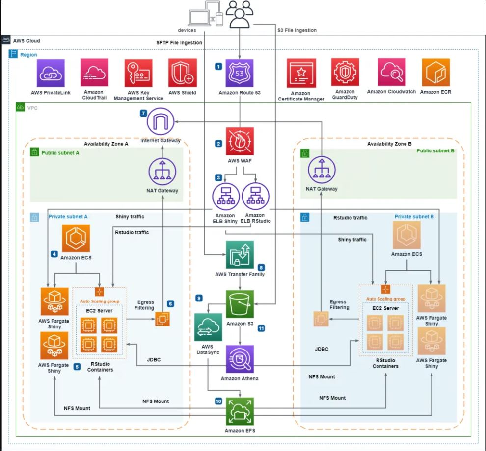
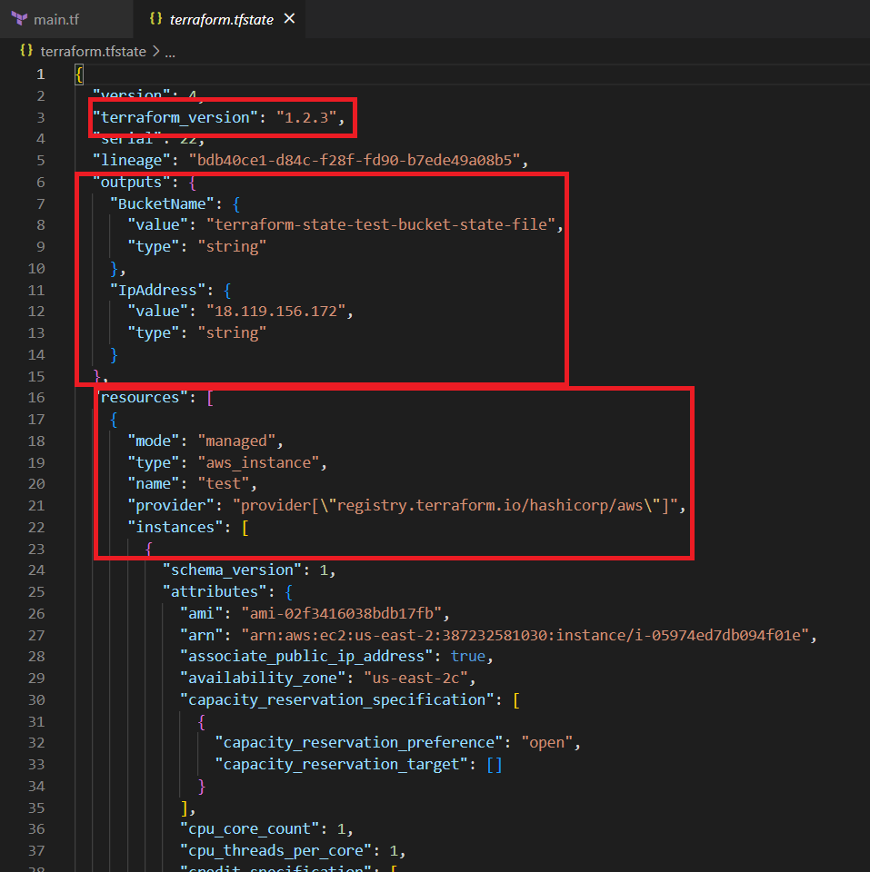

# 🚀 Terraform on AWS – State Management and Remote Backend

This repository contains the code and instructions for a hands-on session on using **Terraform with AWS**, **managing Terraform state**, and configuring a **remote backend using S3**.


## 🧭 Overview

**Topics Covered:**
- Terraform with AWS: Real-world usage
- Terraform state management: What, why, and how
- Remote backend with AWS S3
- Hands-on Lab: Deploying an EC2 instance with remote state


## 📦 Prerequisites

Before beginning, ensure you have:

- An AWS account with necessary access
- [Terraform installed](https://developer.hashicorp.com/terraform/downloads)
- [AWS CLI installed](https://docs.aws.amazon.com/cli/latest/userguide/install-cliv2.html)

---

# 🌐 Terraform with AWS – Real-World Usage

Terraform is widely used with **Amazon Web Services (AWS)** to automate infrastructure provisioning in a safe, predictable, and repeatable way. By defining your infrastructure as code (IaC), you can version-control your entire AWS environment, enforce consistency across deployments, and simplify collaboration among teams.



## 🧱 Why Use Terraform with AWS?

| Feature | Why It Matters |
|--------|----------------|
| **Infrastructure as Code (IaC)** | Version-controlled AWS infrastructure using `.tf` files |
| **Reusable Modules** | Build and share reusable infrastructure blueprints (e.g., for EC2, VPCs) |
| **Automation** | Deploy repeatable environments across dev, staging, and prod |
| **Multi-Region/Multi-Account Support** | Manage all AWS regions and accounts from a single config |
| **Safe Changes** | Terraform plans and applies updates predictably (idempotency) |
| **Team Collaboration** | Use remote state for safe, collaborative work across teams |


## 🛠️ What Can You Manage on AWS with Terraform?

These are some commonly used AWS services you’ll encounter in practice:

- **EC2 Instances** – Virtual machines for running applications  
- **VPC (Virtual Private Cloud)** – Private network setup (subnets, routing, NAT, etc.)  
- **S3 Buckets** – Scalable object storage (including for remote Terraform state)  
- **IAM** – Permissions, roles, and secure access controls  
- **RDS** – Managed relational databases  
- **Lambda** – Serverless functions  
- **ECS/EKS** – Container management at scale  

## 💼 Example Use Cases

| Use Case | How Terraform Helps |
|----------|---------------------|
| **Environment Reusability** | Deploy identical dev/staging/prod with one config and different variable files |
| **CI/CD Pipelines** | Terraform can be triggered from GitHub Actions, GitLab CI, Jenkins, etc. |
| **Secure Access Control** | Manage IAM users/roles consistently and track changes over time |
| **Cost Optimization** | Schedule non-prod EC2 stop/start using tagging and Lambda |
| **Infrastructure Auditing** | Maintain audit logs and track who changed what via version control and remote state |


## 🚀 Getting Started with AWS Provider

To allow **Terraform** to interact with your **AWS account**, you need to:

1. **Configure authentication** using AWS CLI
2. Define the **AWS provider** in your Terraform code

### 🔐 Step 1: Configure AWS CLI with a Named Profile

```bash
aws configure --profile yourmentors

AWS Access Key ID [None]: <Your AWS Access Key ID>
AWS Secret Access Key [None]: <Your AWS Secret Access Key>
Default region name [None]: us-west-2
Default output format [None]: json
```
✅ To verify it's working:

```bash
aws sts get-caller-identity --profile yourmentors
```

### 🔧 Step 2: Create `provider.tf`

Although Terraform lets you define the provider block in **any `.tf` file**, it's ideal to keep it in a dedicated file like `provider.tf` for better organization.

```hcl
# provider.tf

terraform {
  required_providers {
    aws = {
      source  = "hashicorp/aws"
      version = "6.0.0-beta2"
    }
  }
}

provider "aws" {
  region  = "us-west-2"
  profile = "yourmentors"
}
```
---

# 🧾 Terraform State Management

Terraform state is a critical component of any Terraform workflow. It keeps track of the infrastructure Terraform manages and ensures that your configuration files align with real-world resources.


## 🔍 What is Terraform State?

- A **JSON file** (typically named `terraform.tfstate`) that maps your configuration to real infrastructure.
- Contains metadata such as:
  - Resource IDs
  - Attributes of provisioned infrastructure
  - Dependency relationships between resources



## 📁 Where Is the State Stored?

By default, Terraform stores the state **locally** in the directory where you run `terraform apply`.

However, for team collaboration and production environments, it's best practice to use a **remote backend**, like AWS S3, Azure Blob Storage, or HashiCorp Terraform Cloud.


## 🧠 Why Do We Need State?

- **Mapping Resources**: Maps configuration (`main.tf`) to real-world infrastructure.
- **Dependency Management**: Ensures correct order of operations (create/destroy).
- **State Locking**: Prevents concurrent updates from multiple users.
- **Performance**: Speeds up planning by caching resource data.


## ⚠️ Problems with Local State

| Issue               | Description |
|---------------------|-------------|
| No Collaboration    | Hard to share with teammates |
| Risk of Loss        | If deleted or corrupted, can lead to broken infrastructure |
| No Versioning       | Can't roll back to previous states easily |
| No Locking          | Multiple people may apply changes simultaneously |

## 🔐 Best Practices for Managing Terraform State

To ensure your Terraform state remains secure, reliable, and maintainable, follow these best practices:

| Practice                 | Description |
|--------------------------|-------------|
| **Use Remote Backends**  | Always store state remotely (e.g., AWS S3, Azure Blob, Terraform Cloud) in team or production environments. |
| **Enable Encryption**    | When using S3, set `encrypt = true` to encrypt the state file at rest. |
| **Use State Locking**    | Use DynamoDB (for S3), or equivalent services, to prevent concurrent writes and avoid conflicts. |
| **Backup Regularly**     | Schedule regular backups of your state file to protect against accidental deletion or corruption. |
| **Enable Versioning**    | If using S3, enable versioning to recover from accidental overwrites or deletions. |
| **Restrict IAM Access**  | Limit who can read/write to the state backend using IAM policies or access controls. |
| **Avoid Manual Editing** | Never edit `.tfstate` manually unless absolutely necessary and under expert supervision. |
| **Use Workspaces Sparingly** | Prefer separate configurations or modules instead of overusing Terraform workspaces for environment separation. |
| **Monitor and Audit**    | Enable logging and monitoring (e.g., AWS CloudTrail + S3 data events) to track access and changes to the state file. |
| **Separate Environments**| Use different state files or backends for dev/staging/prod environments to avoid cross-environment drift. |

---

# ☁️ Remote Backend with AWS S3

## 📦 What is a Terraform Backend?

A **Terraform backend** determines **how and where** Terraform stores state.

### 💡 Why is Backend Important?

Terraform maintains a state file (`terraform.tfstate`) that maps your configuration to the real infrastructure. By default, this file is stored **locally**, which works fine for simple or individual use cases.

However, for **teams**, **automation**, or **production environments**, local state is risky. You should instead use a **remote backend**.


### 🔄 Types of Backends

Terraform supports many types of backends such as:
- `local` (default)
- `s3`
- `azurerm`
- `gcs`
- `consul`
- `http`

Each backend defines **where** the state lives and optionally **how it's locked and updated**.

Storing state remotely improves reliability, security, and team collaboration.

Terraform supports storing state remotely using **Amazon S3**. This approach provides:
- Centralized state storage
- Team collaboration support
- Built-in versioning and durability


### ✅ Benefits of Remote State (S3)
- Shared access across teams
- Encryption at rest (`encrypt = true`)
- Optional locking via DynamoDB
- Version control (if enabled on the bucket)

### 🚀 Getting Started with Remote Backend S3

In this demo, we’ll configure a **remote backend using AWS S3**.

This will allow you to:

- Store Terraform state remotely and securely
- Enable team collaboration
- Prevent state file corruption through locking

### 🧰 Files Required

| File         | Purpose                                   |
|--------------|-------------------------------------------|
| `main.tf`    | Defines the AWS resource (e.g., EC2)       |
| `provider.tf`| AWS provider configuration                |
| `backend.tf` | Remote backend configuration              |
| `outputs.tf` | (Optional) Output values after deployment |

### 📝 Step-by-Step Instructions

1. **Ensure AWS CLI is configured**

2. **Create S3 bucket for storing the state**

```bash
aws s3api create-bucket \
  --bucket <your-bucket-name> \
  --region us-west-2 \
  --create-bucket-configuration LocationConstraint=us-west-2
```

3. **Enable versioning on the bucket (Recommended)**

```bash
aws s3api put-bucket-versioning \
  --bucket <your-bucket-name> \
  --versioning-configuration Status=Enabled

```
4. **Configure your backend in backend.tf**

```hcl
terraform {
  backend "s3" {
    bucket         = "<your-bucket-name>"
    key            = "terraform.tfstate"
    region         = "<your-aws-region>"
    encrypt        = true
  }
}
```


